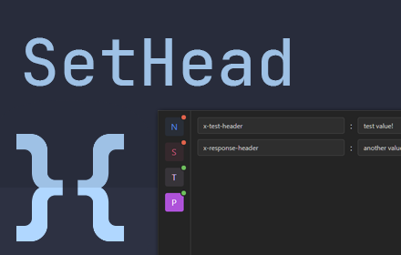

# SetHead

[SetHead](https://github.com/nvitaterna/set-head) is a powerful Chrome application created for developers, testers, and tech enthusiasts who need to manipulate HTTP requests and responses effortlessly. With SetHead, you can customize headers, modify request payloads (coming soon!), and tweak response data (coming soon!) on the fly. Whether you're debugging, testing APIs, or experimenting with web development, SetHead offers a user-friendly interface to streamline your workflow and enhance your productivity.

This extension is [available on the Chrome Web Store](https://chromewebstore.google.com/detail/sethead/oihklpemamhacljgbfljjchoihanajod).



I built this as a developer-focused tool that I could use at my job daily for ease of development and testing.

- Set headers for requests and responses
- Manage groups of headers via profiles
- Extension written in Typescript
- Uses Manifest v3
- No ads
- Completely free

Upcoming Features:

- import/export profiles
- URL filters per profile
- modify query parameters


## Local Development

The easiest way to start with development is cloning this repository. Then run the following:

```
pnpm i
pnpm dev
```

Open your browser and [load the unpacked extension](https://developer.chrome.com/docs/extensions/get-started/tutorial/hello-world#load-unpacked). For example, the folder `.output/chrome-mv3` will contain the dev build for Google Chrome.

This is a [WXT Extension](https://wxt.dev/) project. For further guidance, [visit their Documentation](https://wxt.dev/)
